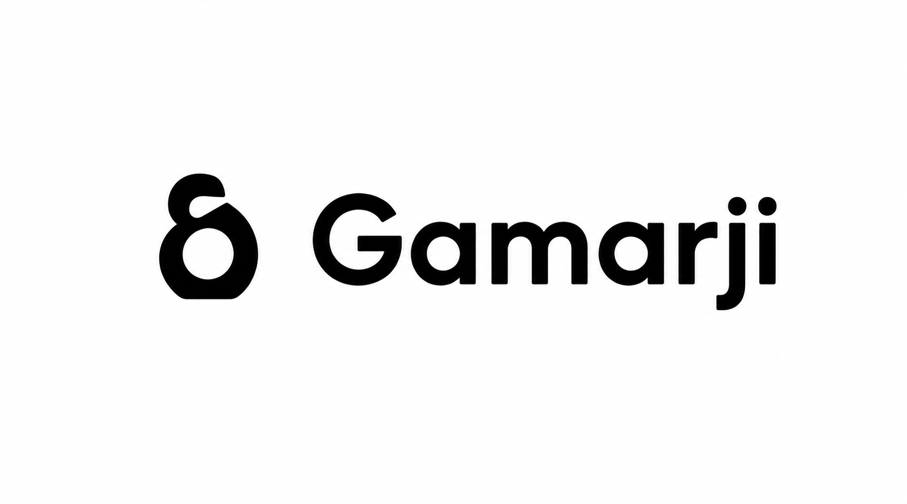
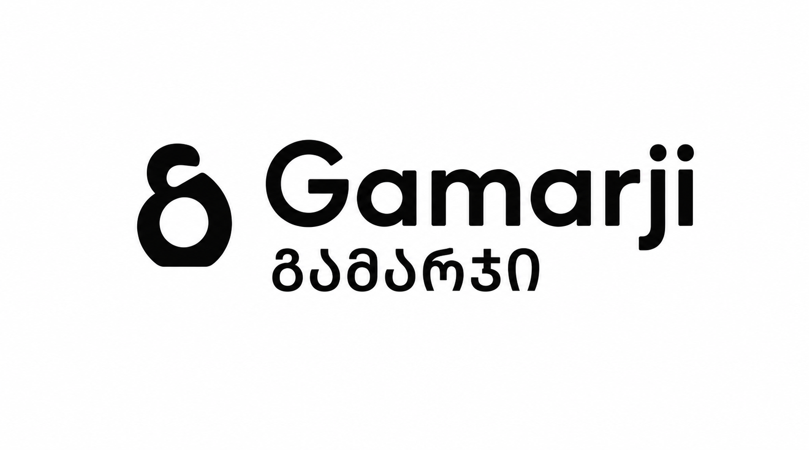

# Gamarji — основа фирменного стиля

Версия документа: 0.1 · 8 сентября 2026 года.
Статус: утверждённое пользователем визуальное направление и правила применения. Это основа будущего брендбука, не готовый комплект производственных исходников.

Задание команде на согласованный редизайн приложения без изменения логики: [APP-REDESIGN-BRIEF.md](APP-REDESIGN-BRIEF.md).

## Зафиксированное решение

Пользователь утвердил разделение на основной логотип без подстрочника и расширенное двуязычное сочетание. Эти правила приоритетнее прежних поисковых концепций в папке outputs. Новое направление или изменение эмблемы требуют отдельного согласования.

## Имя и назначение

- Латиница: **Gamarji**. Русское написание: **Гамарджи**.
- Домен: **gamarji.ge**, зарегистрирован пользователем. Эта запись не подтверждает подключение домена.
- Не использовать прежнее ошибочное написание Gamargi.
- Сервис для повседневной жизни в Грузии: обмен валют с адресами на карте, валютные расчёты, сравнение медицинского страхования.
- Имя бренда придумано на основе звучания грузинского приветствия; не представлять его как подтверждённое словарное слово или придумывать исторический перевод.
- Рабочее грузинское написание: **გამარჯი**. Перед выпуском проверить у носителя языка и набрать настоящим шрифтом. Сгенерированные буквы на эскизе не являются эталоном орфографии.

## Основной логотип

Выбранная эмблема слева + Gamarji справа, **без грузинского подстрочника**.

Использование: шапка сайта, компактные интерфейсы и другие небольшие горизонтальные размещения. Не возвращать мелкую грузинскую строку ради декора. Для очень маленького носителя использовать эмблему отдельно после проверки читаемости.

## Расширенное двуязычное сочетание

Та же эмблема + Gamarji, под ним крупное грузинское написание. Вторая строка — полноценное название, не сноска и не орнамент.

Использование: просторные брендовые размещения, обложки и презентационные материалы. Не втискивать двухстрочный вариант в маленькую шапку.

## Эмблема

- Сохранить выбранный двухъярусный асимметричный силуэт, открытый диагональный верх, крупный нижний просвет и почти плоское скруглённое основание.
- Верх визуально легче нижней части. Не уравнивать механически все толщины и не превращать знак в симметричную восьмёрку.
- Не добавлять горы, флаги, кресты, валютные символы или новые декоративные элементы.
- Чёрное, белое и синее исполнения должны использовать **один векторный мастер**, а не независимо нарисованные или сгенерированные контуры.

## Цвет и типографика

Основа логотипа — чёрный на белом. Для тёмного фона предусмотрено белое исполнение; дополнительный акцент — существующий синий интерфейса **#1CA9F3**. Тёмный фон интерфейса — **#090D11**. Цвета сверены с styles.css; это не поручение менять палитру приложения.

Без градиентов, теней, объёма и текстур. Производственные цветовые профили и печатные значения пока не определены.

Латинская надпись: сохранить характер утверждённого жирного округлого начертания. Точное название шрифта по изображению не установлено; подбор, лицензия и финальная настройка букв остаются отдельной задачей. Не подменять начертание произвольным похожим шрифтом без визуальной проверки.

Для грузинской строки — корректный шрифт с поддержкой мхедрули, обычная плотность набора, без искусственного растягивания и чрезмерной разрядки. Межстрочное расстояние должно исключать столкновение с нижним выносом латинской j.

## Пропорции: ориентиры, не готовый стандарт

Для расширенной версии рабочая высота грузинских букв — примерно 55–60% видимой высоты латинской G. Знак и текст выравниваются оптически, а не только по рамкам. Не растягивать изображение по одной оси.

Точные размеры знака, зазоры, охранное поле и минимальные размеры ещё не утверждены. Предыдущие численные задания генератору не считать измерениями полученного эскиза или обязательными нормами брендбука.

## Характер текстов

Коротко, спокойно, понятно, без лишней рекламы и профессионального жаргона. Названия действий должны объяснять результат. Не обещать гарантированно лучший курс, одобрение страховки или отсутствие ошибок. Источник, свежесть данных и ограничения не скрывать ради визуальной чистоты.

## Что ещё нужно для брендбука

- Подготовить единый векторный мастер эмблемы и точно набранные надписи.
- Проверить грузинское написание и начертание; согласовать шрифты и их лицензии.
- Из мастера получить монохром, инверсию, синий вариант, отдельную эмблему и оба сочетания.
- Проверить эмблему при фактических 16/24/32 px, оба сочетания в целевых размерах и на светлом/тёмном фоне. После проверки установить минимальные размеры и охранное поле.
- Подготовить SVG, прозрачные PNG, favicon и печатные файлы с нужными профилями.
- При необходимости отдельно проверить сходные знаки и правовую доступность: уникальность сейчас не подтверждена.

## Происхождение и границы утверждения

### Локальное внедрение в шапку · 8 сентября 2026

Основной утверждённый PNG подключён напрямую в index.html. brand.css скрывает только поля презентационного изображения и отображает знак с надписью белым на тёмном фоне. Геометрия не перерисована, растяжения по одной оси нет. Это временное растровое исполнение для интерфейса, не векторный мастер брендбука. Альтернативный сгенерированный белый файл отклонён: вместо прозрачности в нём оказался непрозрачный фон.

Проверены загрузка изображения, 320/375/390/768/1280 CSS px без наложения на «Мои данные», переход в данные и калькулятор, возврат по логотипу, повторная загрузка. 244 JS и 47 Python тестов прошли. Снимок: [шапка 390 px](qa/header-390.png). Проверка физического телефона и полный выпускной прогон не выполнялись. Публикации нет.

В references сохранены два растровых эскиза, созданных встроенным ImageGen и одобренных пользователем как направления применения. Они не являются векторными исходниками, прозрачными активами или готовыми файлами печати. Силуэт между генерациями может немного различаться: это нужно устранить на этапе единого мастера.

Две ИИ-роли — графический дизайнер и арт-директор — обсудили решение и рекомендовали убрать микростроку из шапки. Это не заключение приглашённых людей или носителя грузинского языка.

Сохранение этого документа не меняет интерфейс, данные пользователя, логику расчётов и раздел «Мои данные». Внедрение активов и публикация — отдельные шаги с проверками по AGENTS.md.
