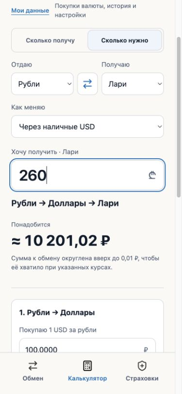
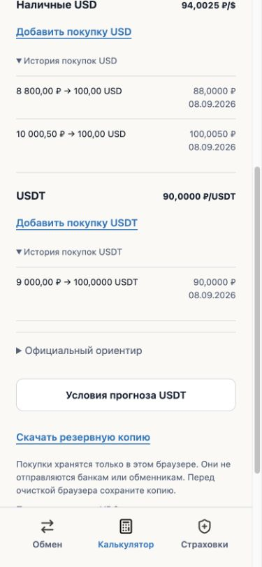
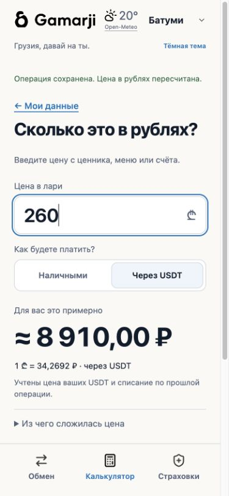
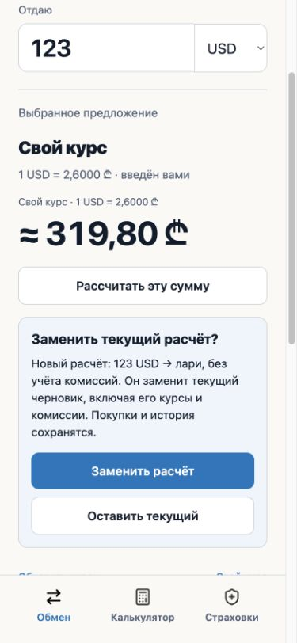

# Gamarji V5.10.1 · тестовый выпуск

8 сентября 2026. Пользователь поручил публикацию для теста. Выпуск включает накопленные UX-1–UX-4, а не новый редизайн. Изменённые ресурсы имеют ключ `5.10.1-test-1`; заголовок страницы остаётся Gamarji, видимая метка — «V5.10.1 · тестовый выпуск».

## Что изменилось относительно V5.10.0

- Состояние страховых карточек сохраняется при выборе и фильтрации; число отфильтрованных планов соответствует списку.
- Компактные карточки раскрывают условия и сравнение в одном блоке; ограничения и источники сохранены. Сравнение доступно по отдельным критериям, на узком экране планы следуют друг за другом.
- Возврат к страховкам восстанавливает видимый смысловой узел и клавиатурный фокус. Закрытые карточки не считаются видимым текстом, повторная активная вкладка не прокручивает к старому месту.
- «Рассчитать эту сумму» начинает прямой расчёт из видимого обмена. Замена непустого черновика подтверждается внутри страницы; данные, изменившиеся после запроса подтверждения, не применяются молча. «Выбрать курс» из калькулятора сохраняет остальные параметры.
- «Калькулятор» остаётся родительской активной вкладкой для «Моих данных» и пересчёта цены. Неактивные кнопки читаемы в тёмной теме.
- Финансовое ядро, формат личного хранилища, карты, бренд и источники не переписаны.

## Итоговые проверки

`node --test tests/*.test.cjs`: **342 passed, 0 failed**. `python3 -B -m unittest discover -s tests -p 'test_*.py'`: **48 passed**. `git diff --check`: без ошибок. Это прогон итоговых файлов с меткой V5.10.1, не перенос результатов старого выпуска.

Встроенный Chromium, отдельный origin `127.0.0.1:8845`, без изменения профиля пользователя:

- Пустой калькулятор; 10 000 ₽ / 100 × 2,6 = 260,00 ₾. Комиссия 100 ₽, затем 1% даёт 254,83 ₾. Для получения 260 ₾ с теми же условиями нужно 10 201,02 ₽. Пустой ввод остаётся пустым; отрицательный ввод даёт явную ошибку.
- USD-покупки 10 000,50/100 и 8 800/100: средняя 94,0025 ₽/USD. Отдельная USDT-покупка 9 000/100: 90,0000 ₽/USDT. История, средние и сохранённые настройки пережили перезагрузку.
- Оплата 260 GEL, списание 100 USDT, полученный возврат 1 USDT: 8 910,00 ₽. Прогноз по 2,6 с комиссией 2% и ожидаемым кешбэком 1%: 9 090,00 ₽. Проценты прогноза не применены повторно к фактической операции. Наличные по 2,6 и средней 94,0025 дают 9 400,25 ₽ за 260 GEL.
- Отрицательный личный курс отвергнут; 2,6000 сохранён и применён. Старые 90 000 ₽ → 2 600,00 ₾ сохраняются при отмене нового обмена; подтверждение 123 USD даёт 319,80 ₾.
- Живой InteliExpress: 123 USD по 2,6090 → 320,91 ₾. Обратное направление использует sell 2,6130. Адресный выбор курса сохраняет 123 GEL и обратное направление.
- Карта InteliExpress: Батуми, 25 Baratashvili Street; ссылка на точку 41.6492744,41.6374353 без начала чужого маршрута. Нативное приложение телефона не проверялось.
- Classic/Premium: выбор, сравнение, переход к «Лекарства», уход в обмен и возврат сохраняют положение 2142 и фокус критерия. Замена плана на GPI оставляет неизвестную цену неизвестной; фильтр ARDI показывает 5 планов; очистка выбора работает.
- Кнопка резервной копии вызвана на тестовом профиле; сериализация и отказ хранилища проверены автоматически. Содержимое скачанного файла отдельно не открывалось.
- Тёмная тема сохранилась после reload; затем возвращена светлая. В журнале приложения при выполненных сценариях ошибок и предупреждений JS не получено.

Обмен, калькулятор с суммой 1 млрд, заполненные данные/история, цена в рублях и сравнение: **50 состояний** (5 ширин 320/375/390/768/1280 × 2 темы × 5 экранов). Размер документа и позиции видимых контролов проверены: горизонтального выхода за ширину нет. Осмотрены снимки узких экранов; для широкого окна обычный снимок инструмента обрезал область вне видимой панели, поэтому использованы также DOM-измерения и полный снимок. Полный снимок содержит артефакты склейки закреплённых панелей и не является самостоятельным доказательством их поведения. Ни измерения, ни снимки не выдаются за тест физического телефона.

Примеры тестовых данных и результатов:






## Курсы и сохранность изменений

Перед выпуском получен более свежий уже опубликованный снимок `f725415` (15:21 UTC): официальные курсы, 13 банков USD и 13 EUR, MJC/Rico/InteliExpress для USD/EUR/RUB, failures пусты. Локальный запрос к MJC раньше не прошёл проверку; его результат не подменил более свежие проверенные данные GitHub. Собранные в этом проходе более ранние шесть JSON сохранены в отдельном git stash с названием `Local release rate collection superseded by newer verified remote snapshots`; изменения интерфейса и прочие рабочие файлы не откатывались.

При недоступности источников интерфейс по-прежнему помечает старые данные и не выдаёт их за свежие. Таймауты, исчезновение поставщика, изменение и истечение котировки в момент подтверждения, недоступное хранилище проверены модельными регрессиями; в живом браузере часы и серверные ответы не подменялись.

## Отпечатки проверенной сборки

```text
b633c27031eb23ddd342d3eb16227178464d2510478f5ab08ce00aee9099aecf  index.html
9717dd0c3c353fc270cf4c30908b6a998a988d2cb70d27eb98931a45a2869dee  app.js
0579c850d0a43b3c435da4858a27d70e353f23ec0b03b4f969209f38561519ec  insurance.js
e2bad72249887b94cd06ac24ba47f4e5344e2eec849382d8f182df338517183e  insurance.css
0d845accb9cb4e0e4acf74959e5742f24a48441a0fd5c96a3dc583e171e1d1d6  theme.css
```

## Ограничения и публикация

Тестовый выпуск, не обещание абсолютного отсутствия ошибок. Физические iPhone/Android, экранные клавиатуры, VoiceOver/TalkBack, Safari/Firefox, запуск нативных карт не проверялись. Страховые договоры повторно не исследовались; справочник не является персональной рекомендацией. Домены и настройки доступа не менялись.

Публикация считается подтверждённой только после успешного развёртывания и повторной проверки публичного адреса; итог будет зафиксирован отдельным дополнением. Личные записи в публичном браузере не использовать для тестовых покупок.
